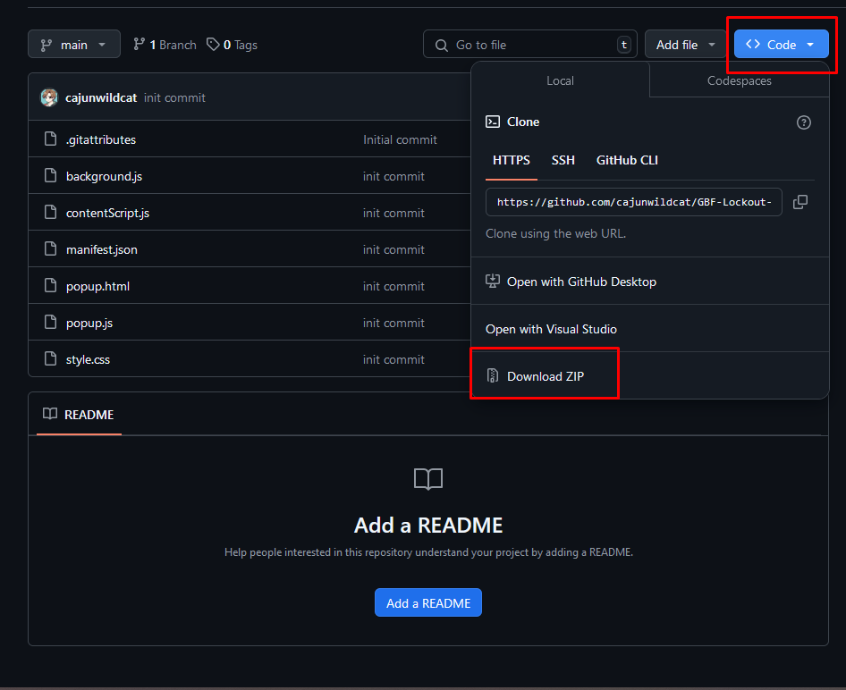
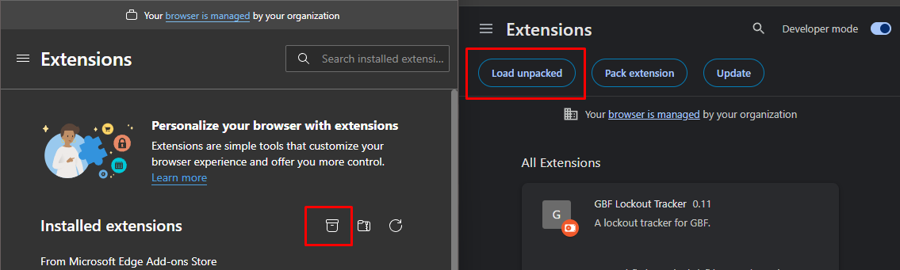
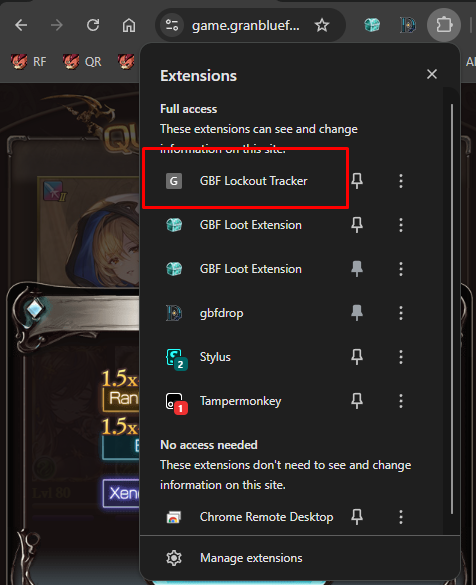

# Installation Instructions
1. Download the ZIP of the repository

2. Un-zip the folder
3. Navigate the your browser's extension manager page and click the "Load unpacked" button (left is in Edge, right is in Chrome)

4. Enable the extension

# Usage Instructions
1. Click the extension button in the extension list

2. Use the "Clear Data" button to clear any times shown before starting a new testing session
3. Each row is a "set" of times, for a new set to be started, you must "Restart" a trial fight
